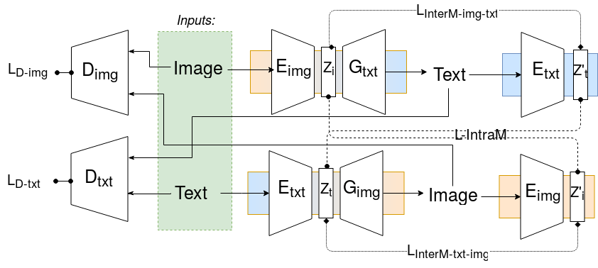
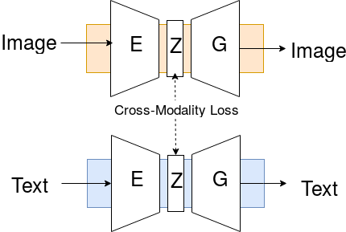

# Integrating Video and Language with Generative Adversarial Networks

I am going to use the README as a tracker of Goals per Week,

__Goals:__

- Train the [_pre_training_ paired autoencoder network](https://github.com/vglsd/thesis/blob/master/abstract/m3GAN-entavelis.pdf)
- Test it on a Cross Modal Retrieval Task
    - Measure mAP 
    - Measure Top-k Error Rate

### Questions

### Notes

- Check the loss functions used in [Show, Adapt and Tell](https://github.com/tsenghungchen/show-adapt-and-tell#mscoco-captioning-dataset)

### Based on:

- [DiscoGAN](https://github.com/SKTBrain/DiscoGAN)
- [OpenNMT-py](https://github.com/OpenNMT/OpenNMT-py)
- [PyTorch-Seq2Seq Example](https://github.com/howardyclo/pytorch-seq2seq-example/)
- [CNN-Sentence_Classification](https://github.com/A-Jacobson/CNN_Sentence_Classification)
- [PyTorch Tutorial: Image Captioning](https://github.com/yunjey/pytorch-tutorial/tree/master/tutorials/03-advanced/image_captioning)
